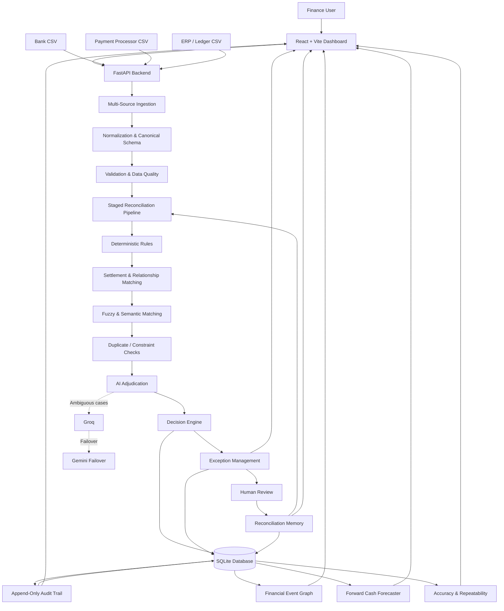

# ReconAgent

**AI-assisted, explainable multi-source financial reconciliation engine.**

ReconAgent reconciles bank statements, payment processor/gateway settlements, and ERP/ledger records (with support for invoices, orders, and refunds), automatically resolving what the evidence proves, explaining every decision in plain language, and escalating genuine ambiguity to a human — instead of maximizing match rate by guessing.

> Deterministic rules handle the clear majority of matches. AI is used only for genuine ambiguity. Anything the system can't safely resolve stays visible as an explicit, actionable exception.

---

## Features

### Reconciliation engine
- **Multi-source ingestion** — bank, payment processor, and ERP/ledger CSV imports, normalized into one canonical transaction schema (raw record always preserved alongside the normalized one).
- **Deterministic rule engine** — versioned, ID'd rules (exact identity, fee-adjusted settlement, currency/date/reference checks) applied before any AI involvement.
- **Fuzzy & semantic matching** — handles name drift, formatting differences, and paraphrased descriptions where exact rules don't apply.
- **AI adjudication (ambiguity only)** — Groq-backed, with Gemini as failover; called only when deterministic and fuzzy/semantic stages can't confidently resolve a case. Invalid or missing AI output fails safely back to human review — AI can never override a hard financial constraint (currency, amount, duplicate consumption).
- **Relationship types** — one-to-one, one-to-many (split invoices), and many-to-one (batched settlements), with duplicate and double-consumption protection.
- **Explicit decision states** — `MATCH`, `PARTIAL_MATCH`, `AMBIGUOUS`, `UNMATCHED`, `DUPLICATE`, `INVALID`, with illegal state transitions rejected.
- **Standard exception taxonomy** — categorized, severity-rated exceptions (amount mismatch, missing counterpart, currency mismatch, partial/overpaid, duplicate, refund issues, and more) with a full lifecycle: `OPEN → IN_REVIEW → RESOLVED / REJECTED / ESCALATED`, and a permanent, append-only resolution history.
- **Final batch validation** — a dedicated post-match validator blocks a false "success" status if duplicate consumption, broken relationships, or inconsistent batch totals are detected.
- **Idempotent processing** — re-running a batch reuses the existing result rather than duplicating work, unless explicitly forced.
- **Full audit trail** — every decision records the rule, evidence, score, candidate set considered, pipeline/rule-set/normalization versions, and AI provider/model if used.
- **Reconciliation memory** — human-approved counterparty/reference mappings from resolved exceptions become reusable knowledge for future automation.
- **Forward Cash Forecaster** — projects future cash position from confirmed matches, observed settlement lag, and open exceptions with directional cash implications, explicitly separating `CONFIRMED` / `EXPECTED` / `AT_RISK` / `UNCLASSIFIABLE` amounts (unclassifiable cash is never silently folded into the forecast).
- **Measured accuracy & repeatability** — precision, recall, F1, false-match rate, and multi-run repeatability testing against a ground-truth answer key.

### Dashboard / UI
- **Overview** — batch health, match rate, reconciled value, exception summary, and process breakdown (deterministic vs. fuzzy/semantic vs. AI vs. human-resolved) at a glance.
- **Money Flow (event graph)** — visual Order → Payment → Settlement → Bank → ERP trail, with amount-difference explanations (e.g. gateway fees) shown inline and incomplete chains clearly flagged.
- **Exceptions** — severity- and impact-prioritized review queue with human-readable evidence, recommended next actions, and resolution controls.
- **Audit Trail** — human-readable decision explanations first, full technical/JSON evidence available behind an expandable section.
- **Memory** — previously approved mappings and learned rules from human resolutions.
- **Cash Outlook** — visual 30-day cash forecast with a cash-at-risk breakdown by category.

---

## Project structure

```text
recon-agent/
├── backend/
│   ├── app/
│   │   ├── main.py            # FastAPI app & routes
│   │   ├── config.py          # centralized, versioned configuration
│   │   ├── db.py               # models + SQLite
│   │   ├── pipeline/           # ingest → validate → normalize → match → validate
│   │   ├── rules/               # rule catalog
│   │   ├── exceptions/          # taxonomy, classifier, lifecycle
│   │   ├── audit/
│   │   ├── accuracy/            # metrics, calibration, repeatability job
│   │   ├── forecast/            # Forward Cash Forecaster
│   │   └── llm/                 # Groq client + Gemini failover
│   └── requirements.txt
├── frontend/
│   ├── src/
│   │   ├── pages/                # Overview, Money Flow, Exceptions, Audit, Memory, Cash Outlook
│   │   ├── components/
│   │   └── api/
│   └── package.json
├── tests/
│   ├── reconciliation/
│   └── forecast/
└── sample_data/                  # bank / processor / erp CSVs + answer_key.csv
```

---

## Getting started

### Prerequisites
- Python 3.10+
- Node.js 18+
- (Optional, for AI adjudication) A Groq API key, and optionally a Gemini key as failover. Without these, ambiguous cases fail safely to manual review instead of being guessed at.

### 1. Backend

```bash
cd backend
python -m venv venv
source venv/bin/activate        # Windows: venv\Scripts\activate
pip install -r requirements.txt
```

Configure environment variables (create `backend/.env` or export directly):

```bash
GROQ_API_KEY=your_key_here        # optional — enables AI adjudication tier
GEMINI_API_KEY=your_key_here      # optional — failover if Groq is unavailable
```

Run the backend:

```bash
uvicorn app.main:app --reload
```

The API is now available at `http://localhost:8000` (interactive docs at `/docs`).

### 2. Frontend

```bash
cd frontend
npm install
npm run dev
```

The dashboard is now available at `http://localhost:5173` (or whichever port your dev server reports).

### 3. Run the test suite

```bash
# from the repository root
pytest
```

### 4. Try it with sample data

Use the CSVs in `sample_data/` (bank, processor, ERP exports, plus an `answer_key.csv` for accuracy scoring) to run an end-to-end reconciliation:

1. Upload the three sample CSVs via the **Upload** tab (or `POST /api/upload`).
2. Trigger reconciliation via the **Overview** tab (or `POST /api/reconcile/{batch_id}`).
3. Explore results across **Money Flow**, **Exceptions**, **Audit Trail**, **Memory**, and **Cash Outlook**.

### 5. Measure repeatability & accuracy (optional)

```bash
cd backend
python -m app.accuracy.repeatability_job --runs 5
```

Writes a before/after repeatability and accuracy report to `backend/reports/`.

---

## Core API endpoints

| Endpoint | Purpose |
|---|---|
| `POST /api/upload` | Ingest source CSVs for a batch |
| `POST /api/reconcile/{batch_id}` | Run the full reconciliation pipeline (idempotent) |
| `GET /api/results/{batch_id}` | Batch-level results summary |
| `GET /api/reconciliation/{match_id}` | Full evidence for a single decision |
| `GET /api/exceptions/{batch_id}` | Exception queue for a batch |
| `POST /api/exceptions/{exception_id}/resolve` | Resolve/reject/escalate an exception |
| `GET /api/exceptions/{match_id}/history` | Full resolution history for a match |
| `GET /api/audit/{batch_id}` | Full audit trail for a batch |
| `GET /api/accuracy/{batch_id}` | Precision/recall/F1 against an answer key |
| `POST /api/forecast/{batch_id}` | Run the Forward Cash Forecaster (idempotent) |
| `GET /api/forecast/{batch_id}` | Latest cash forecast curve |
| `GET /api/forecast/{batch_id}/line/{line_id}` | Explainability for a single forecast line |
| `GET /api/contract` | The reconciliation contract, in code |

---

## Design principles

- **Deterministic first, AI only for genuine ambiguity.** AI can interpret ambiguity; it cannot override a financial hard constraint.
- **Explainable by default.** Every match or exception carries structured evidence, not just a confidence number.
- **Reproducible.** Same input + same configuration + same versions → same outcome, every time.
- **Honest about uncertainty.** The system prefers an explicit `AMBIGUOUS`/`UNMATCHED`/`UNCLASSIFIABLE` result over an unjustified guess — including in the cash forecast.


## Project Architecture

ReconAgent follows a **deterministic-first, AI-assisted, human-in-the-loop architecture**. The system progressively processes financial records through ingestion, normalization, validation, reconciliation, exception handling, memory, audit, and forecasting layers.



### Architecture Layers

| Layer                       | Responsibility                                                                                                                                            |
| --------------------------- | --------------------------------------------------------------------------------------------------------------------------------------------------------- |
| **Frontend**                | React + Vite dashboard for uploading data, monitoring reconciliation, reviewing exceptions, exploring memory, audit trails, money flow, and cash outlook. |
| **API Layer**               | FastAPI endpoints that connect the dashboard with the reconciliation and analysis services.                                                               |
| **Ingestion Layer**         | Accepts Bank, Payment Processor, and ERP/Ledger CSVs while preserving the original raw records.                                                           |
| **Normalization Layer**     | Converts different source formats and column names into a common canonical transaction schema.                                                            |
| **Validation Layer**        | Validates financial fields, relationships, currencies, dates, amounts, and data consistency before matching.                                              |
| **Reconciliation Pipeline** | Progressively resolves transactions using deterministic rules, relationship matching, fuzzy/semantic matching, duplicate protection, and AI adjudication. |
| **AI Layer**                | Groq performs last-mile ambiguity resolution, with Gemini available as failover. AI cannot override hard financial constraints.                           |
| **Exception Layer**         | Converts unresolved or unsafe cases into categorized, severity-rated exceptions with a complete lifecycle.                                                |
| **Human Review**            | Allows reviewers to resolve, reject, or escalate genuine ambiguity instead of forcing an unsafe match.                                                    |
| **Memory Layer**            | Stores human-approved mappings and learned rules so previously resolved patterns can be reused in future batches.                                         |
| **Audit Layer**             | Maintains an append-only record of decisions, evidence, rules, versions, candidates, and AI provenance.                                                   |
| **Event Graph**             | Represents the financial chain as **Order → Payment → Settlement → Bank → ERP**.                                                                          |
| **Forecast Layer**          | Generates the Forward Cash Forecast using confirmed matches, observed settlement lag, and open exceptions.                                                |
| **Accuracy Layer**          | Measures precision, recall, F1, false-match rate, confidence calibration, and repeatability against ground truth.                                         |
| **Database**                | Persists batches, transactions, reconciliation decisions, exceptions, memory, audit information, and forecast data.                                       |

### Reconciliation Decision Flow

```text
                 Source Data
                     │
                     ▼
              Ingestion & Schema
                     │
                     ▼
             Normalize & Validate
                     │
                     ▼
        ┌───────────────────────────┐
        │  Staged Reconciliation    │
        │                           │
        │  1. Deterministic Rules   │
        │  2. Settlements           │
        │  3. Fuzzy / Semantic      │
        │  4. Duplicate Checks      │
        │  5. AI Adjudication       │
        └─────────────┬─────────────┘
                      │
             ┌────────┴────────┐
             ▼                 ▼
        High Confidence      Ambiguous
             │                 │
             ▼                 ▼
          MATCH          Human Review
                               │
                         ┌─────┴─────┐
                         ▼           ▼
                      Resolve     Reject /
                         │        Escalate
                         ▼
                 Reconciliation
                     Memory
                         │
                         ▼
                  Future Batches
```

### Data and Intelligence Flow

After reconciliation, the persisted results feed multiple intelligence layers:

```text
                    Reconciled Results
                           │
          ┌────────────────┼────────────────┐
          ▼                ▼                ▼
     Audit Trail      Event Graph      Cash Forecast
          │                │                │
          ▼                ▼                ▼
     Explainability     Money Flow      Cash Position
                           │
                           ▼
                       Dashboard
```

This architecture ensures that **reconciliation, exception handling, memory, auditability, financial flow analysis, and cash forecasting are connected through the same persisted financial decisions**, rather than operating as isolated dashboard features.
